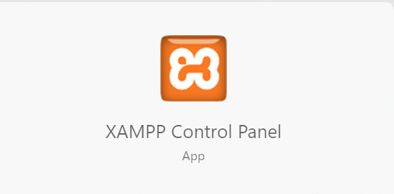
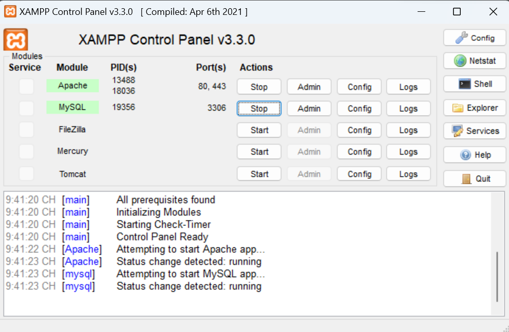
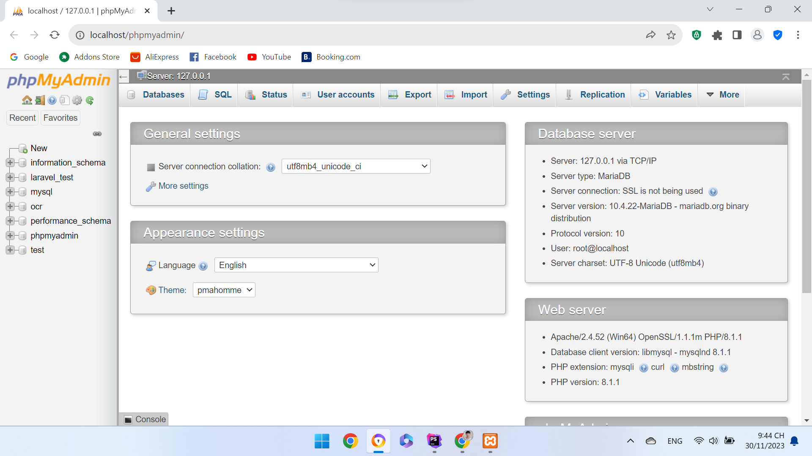
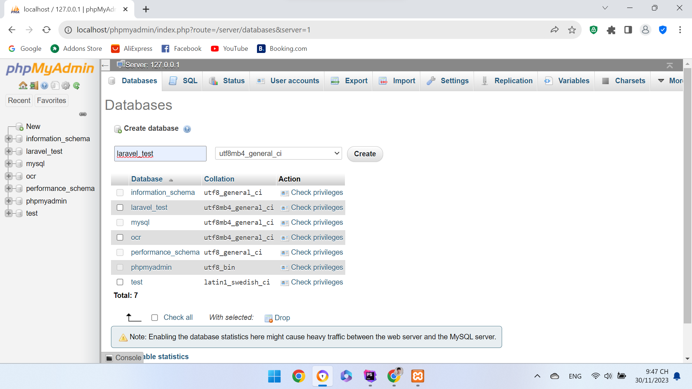
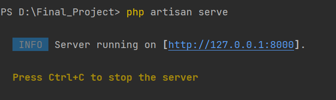
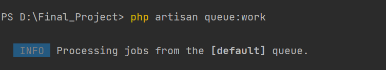

<h1>Các bước cài đặt trang web trên local</h1>
<h2>Bước 1: Tải và cài đặt ứng dụng xampp</h2>

<h2>Bước 2: Tải và cài đặt composer theo đường dẫn https://getcomposer.org/download/</h2>
<h2>Bước 3: Mở xampp và bật Apache và MySQL, sau đó nhấn vào nút Admin của MySQL để truy cập trang quản lý cơ sở dữ liệu</h2>

<h2>Bước 4: Nhấn nút New trên sidebar bên trái để tạo cơ sở dữ liệu mới tên là "laravel_test" sau đó nhấn Create</h2>

<h2>Bước 5: Mở cmd và truy cập vào thư mục code sau đó thực hiện các lệnh sau:</h2>
<h4>Tải các file cần thiết: composer install</h4>
<h4>Tạo các bảng trong cơ sở dữ liệu: php artisan migrate</h4>
<h4>Khởi tạo cơ sở dữ liệu cần thiết: php artisan db:seed</h4>
<h4>Chạy serve ảo của laravel: php artisan serve</h4>

<h4>nhấn vào đường link để truy cập trang web</h4>
<h2>Bước 6: Để gửi mail thông báo cho người mua hàng</h2>
<h4>Chạy hàng đợi để gửi mail: php artisan queue:work</h4>

